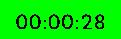
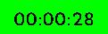
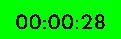

# Note
When reviewing with a player, I always gave written notes in the form of [Markdown](https://en.wikipedia.org/wiki/Markdown). An example is below.

Markdown for written reviews is criminally under utilized. The ability to easily include images, separate/emphasise points, and more, are all phenomenal ways to keep the player engaged. While not a replacement for verbal 1:1 reviews with players, preparing the review in written form prior to reviewing with the player gives yourself an outline to concisely and effectively hit your talking points during the review, but also gives the player a reference for the future.

This project aims to facilitate the process of producing written reviews. While watching a replay, pressing a key will result in the current timestamp being fetched, and a window shown for you to take your notes for that timestamp. Another keypress will insert an image of the current screen into the notes. In the future, I'd like to add the ability to draw on the canvas of included images.

## Thresholding
In `Screen.java` resides a function `threshold(BufferedImage image, int r, int g, int b)`. Within this function a variable exists, `range`. You can see the differences in output in the following examples.

### range_15

### range_25

### range_45
